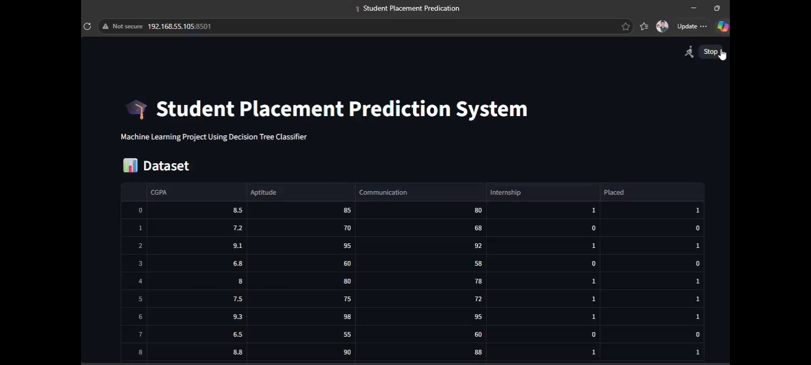
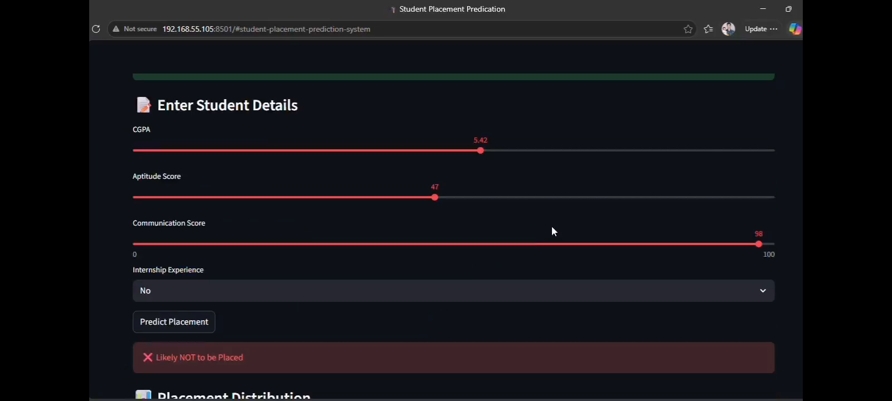

# 🎓 Student Placement Prediction System

## 📌 Project Overview

The **Student Placement Prediction System** is a Machine Learning application that predicts whether a student is likely to be placed based on academic performance and skill-related factors.

The system analyzes various parameters and provides a prediction indicating whether the student has a high chance of being placed.

This project demonstrates the practical application of Machine Learning, Data Analysis, and Interactive Web Development using Streamlit.

---

## 🎯 Objectives

- Predict student placement outcomes using Machine Learning.
- Analyze academic and skill-based factors.
- Provide an interactive user interface.
- Demonstrate real-world predictive analytics.
- Help students understand placement readiness.

---

## 🚀 Features

✅ Placement prediction using Machine Learning

✅ Interactive Streamlit web application

✅ User-friendly input interface

✅ Data visualization with Matplotlib

✅ Model performance evaluation

✅ Real-time prediction results

---

## 📊 Input Parameters

The prediction model uses the following inputs:

- CGPA
- Aptitude Score
- Communication Skills Score
- Internship Experience

---

## 🛠️ Technologies Used

- Python
- Pandas
- Scikit-learn
- Matplotlib
- Streamlit

---

## ⚙️ Installation

### Step 1: Clone the Repository

```bash
git clone https://github.com/your-username/task-4-yourname.git
```

### Step 2: Navigate to the Project Directory

```bash
cd task-4-yourname
```

### Step 3: Install Required Libraries

```bash
pip install streamlit pandas matplotlib scikit-learn
```

### Step 4: Run the Application

```bash
streamlit run app.py
```

### Step 5: Open the Browser

The application will automatically launch in your default web browser.

---

## 🤖 Machine Learning Algorithm

### Decision Tree Classifier

The project uses a **Decision Tree Classifier** to learn patterns from student data and predict placement outcomes based on the provided features.

---

## 🧠 How It Works

1. User enters student details.
2. Input data is processed.
3. The trained machine learning model analyzes the inputs.
4. Placement prediction is generated.
5. Results are displayed through the Streamlit interface.

---

## 📈 Example

### Input

- CGPA: 8.5
- Aptitude Score: 80
- Communication Skills: 75
- Internship Experience: Yes

### Prediction

✅ Likely to be Placed

---

## 🎓 Educational Value

This project is suitable for:

- B.Tech Students
- Machine Learning Beginners
- Data Science Enthusiasts
- Academic Mini Projects
- Internship Projects

---

## 🔮 Future Enhancements

- Larger training dataset
- Multiple ML algorithm comparison
- Advanced feature engineering
- Placement probability score
- Database integration
- Student profile management
- Deployment on cloud platforms

---
## 📷 Screenshots

### Home Page



### Output



---

## 👨‍💻 Author

**Jammikuntla Spurthi Sree**  
B.Tech CSE Student

### Decodelabs Internship Project

---

⭐ If you found this project useful, consider giving it a star on GitHub!
